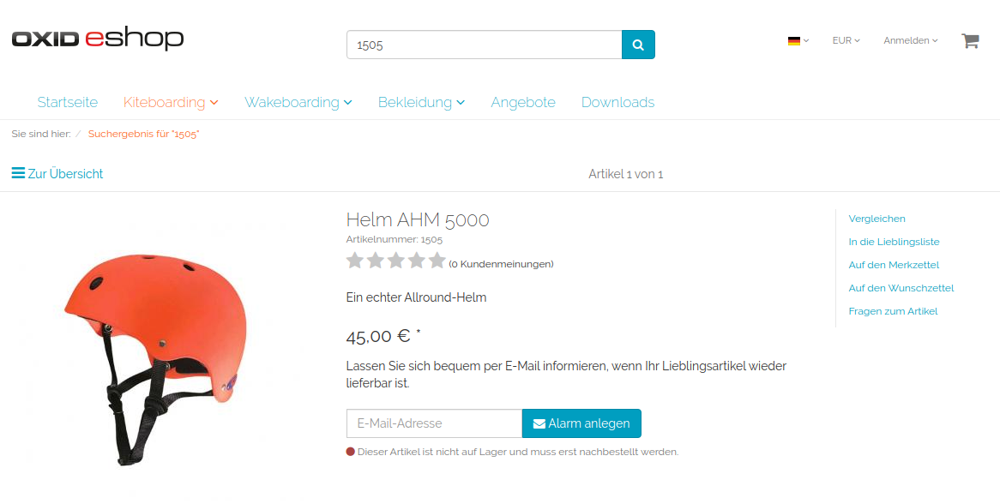

[](https://github.com/patrick-blom/article-alert)
[](https://packagist.org/packages/patrick-blom/article-alert-poc)
[](https://packagist.org/packages/patrick-blom/article-alert-poc)
[](https://github.com/patrick-blom/article-alert/blob/master/LICENSE)
[](https://twitter.com/pbl0m)

Article Alert Module POC
==================

This is a **proof of concept** to introduce hexagonal module architecture in OXID eShop 6.2

### About the module
This module adds the possibility to create an email alert for out of stock products to the article details page.

The customer can enter his/her email address on the article details page which will saved with additional information about the article in a storage. 

This storage can be consumed e.g. by a micro service which sends a notification if the product is available again. **(Not part of the module!)**



### Delimitation
This module is a proof of concept and not ready for production usage in any kind.

### Compatibility

* The module is OXID eShop 6.2 and higher only
* The module was built and will work on the OXID eShop Community Edition
* The module should work on OXID eShop Professional Edition and OXID eShop Enterprise Edition 
* The module was tested on the OXID eShop Community Edition
* The module was **not tested** on OXID eShop Professional Edition and OXID eShop Enterprise Edition 


### Requirements

* OXID eShop 6.2 Community Edition (or higher)
* PHP 7.1 (or higher)

### Module installation via composer

#### Default installation via packagist (recommend)
* add the module to your shop composer.json
    * `cd <shop root>`
    * `composer require patrick-blom/article-alert-poc`

#### Alternative installation via GitHub (manual)
* create a new folder called "thirdparty" with the subfolder "pb" at the shop root level (same level as the composer.json)
    * `cd <shop root>`
    * `mkdir -p thirdparty/pb`  
* clone the repository to the new folder
    * `git clone git@github.com:patrick-blom/article-alert.git thirdparty/pb/ArticleAlert` 
* navigate back to the shop root level and add the repository to composer.json
    * `composer config repositories.patrick-blom/article-alert-poc path thirdparty/pb/ArticleAlert`
* add the module to your shop composer.json
    * `composer require patrick-blom/article-alert-poc`    

#### OXID eShop module activation (identical for default && alternative installation)
* prepare the module configuration for eShop 6.2
    * `vendor/bin/oe-console oe:module:install-configuration source/modules/pb/ArticleAlert/`
    * `vendor/bin/oe-console oe:module:apply-configuration`
* activate the module
    * `vendor/bin/oe-console oe:module:activate articlealertpoc`
* regenerate the unified namespace and the views, because the module adds new database fields
    * `vendor/bin/oe-eshop-unified_namespace_generator`
    * `vendor/bin/oe-eshop-db_views_regenerate`
 
### Usage

* After the installation and activation the module is ready to use and integrates the functionality in the `details_productmain_tobasket` block on the product details page. 
* By default you'll find a file called `article_alert_db` under `<shop root>/tmp` which holds all information about the alerts.
   
### Testing

#### !Attention!
Even if this is a proof of concept. The testing process should only be done in a development environment or CI pipeline.

#### Preparing
* Install the module as described
* Prepare the [OXID Testing Library](https://github.com/OXID-eSales/testing_library) likes described in their repository 
or use the [oxvm_eshop](https://github.com/OXID-eSales/oxvm_eshop) / [docker-eshop-sdk](https://github.com/OXID-eSales/docker-eshop-sdk)
* Add `pb/ArticleAlert` to the partial module paths in your test_config.yml (e.g: `partial_module_paths: 'pb/ArticleAlert'`)
* Copy the `config.inc.TEST.php.dist` from the vendor module directory to your shop root and rename it to `config.inc.TEST.php`
* Adjust the settings in the `config.inc.TEST.php` to your needs (test database name, error reporting, etc)
* Modify your `config.inc.php` and ensure that the `config.inc.TEST.php` will be loaded during the tests
```php
    // bottom of config.inc.php
    if (defined('OXID_PHP_UNIT')) {
        include "config.inc.TEST.php";
    }
```

#### Run tests
* Navigate to the shop root
* Run the test using the following command: `php vendor/bin/runtests <absolute path to shop root>/source/modules/pb/ArticleAlert/Tests`
* Run the coverage using the following command: `php vendor/bin/runtests-coverage <absolute path to shop root>/source/modules/pb/ArticleAlert/Tests`

#### Run static analysis
* Install phpstan using `composer require --dev phpstan/phpstan`
* Run the static analysis using the following commands
    * Navigate to the `<shop root>`
    * Run phpstan with  arguments `vendor/bin/phpstan analyze -c source/modules/pb/ArticleAlert/phpstan.neon` 

### License
The module is released under GPL-3.0. For a full overview check the [LICENSE](LICENSE) file.
